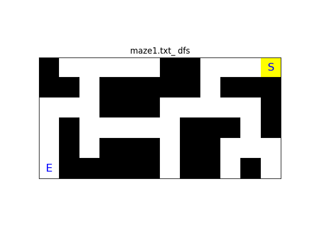
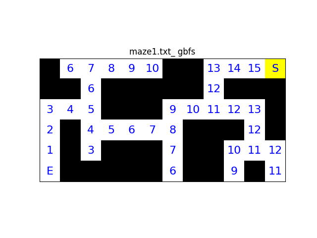
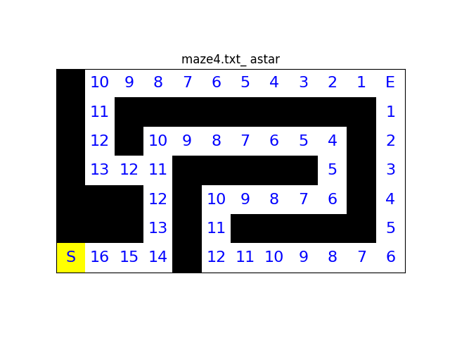

# ai-search-visualiser <!-- omit in toc -->

- [Overview](#overview)
- [Key Learnings](#key-learnings)
- [Demo](#demo)
  - [Legend:](#legend)
  - [Maze 1](#maze-1)
    - [Breadth-first search(BFS)](#breadth-first-searchbfs)
    - [Depth-first search(DFS)](#depth-first-searchdfs)
    - [Greedy best-first search(GBFS)](#greedy-best-first-searchgbfs)
  - [Maze 4](#maze-4)
    - [Greedy best-first search(GBFS)](#greedy-best-first-searchgbfs-1)
    - [A\* search(A\*)](#a-searcha)
- [Setup and Usage](#setup-and-usage)
  - [Maze file format](#maze-file-format)
- [Acknowledgements](#acknowledgements)

## Overview

This project implements breadth-first search (BFS), depth-first search (DFS), greedy best-first search (GBFS), and A\* search (A\*) to find solutions to mazes.

## Key Learnings

- Gained foundational understanding of BFS, DFS, and GBFS
- Implemented these algorithms in Python and visualised them using Matplotlib
- Observed how each algorithm explores the maze differently, as shown [Demo](#demo) section

## Demo

### Legend:

- White: path
- Black: wall
- Yellow: visited cells
- Green: solution path
- S: start point
- E: end point

### Maze 1

#### Breadth-first search(BFS)


#### Depth-first search(DFS)



#### Greedy best-first search(GBFS)



### Maze 4

#### Greedy best-first search(GBFS)


#### A\* search(A\*)



## Setup and Usage

```shell
# Create virtual environment
python -m venv .venv

# Activate virtual environment (Windows)
.venv\Scripts\activate

# Activate virtual environment (macOS/Linux)
source .venv/bin/activate

# Install packages
pip install -r requirements.txt

# Run script
python main.py <path_to_maze> <search_type>
```

Replace `<path_to_maze>` with the maze file path.  
Replace `<search_type>` with one of `bfs`, `dfs`, `gbfs`, or `astar` (all lowercase).

### Maze file format

- Each maze should be a text file.
- `S` marks the start, `E` marks the end.
- `#` represents walls, ` ` represents paths.
- All rows must have the same length.

You can try the script with your own maze by providing the maze file path and selecting a search algorithm when running main.py

## Acknowledgements

This maze-solving project was developed after completing [Week 0 (Search) of CS50’s Introduction to Artificial Intelligence with Python](https://cs50.harvard.edu/ai/weeks/0/). The search concepts and problem structure from the Search module inspired parts of this project, although all implementation and extensions in this repository are my own.
